<!--
  ╔══════════════════════════════════════════════════════════════╗
  ║         ullas23 | GitHub Profile README                                 ║
  ║         Purple Team · SOC · AI-Powered Security                         ║
  ╚══════════════════════════════════════════════════════════════╝
-->
<div align="center">

</div>

<!--
<div align="center">
[](https://git.io/typing-svg)
</div>
<br/>
-->


## `ullas23@github:~$ whoami`
```bash
┌─────────────────────────────────────────────────────────────┐
│                                                                        │
│   Name        :  Ullas T S                                             │
│   Alias       :  ullas23                                               │
│   Role        :  Grey Hat Hacker                                       │
│   Focus       :  SOC • Network Security • Incident Response            │
│   Interests   :  AI × Cybersecurity | Cybersecurity × AI               │
│   Platform    :  Linux | Windows                                       │
│   Lifestyle   :  Basketball | CTFs                                     │
│   Status      :  Learning...                                           │
│                                                                        │
└─────────────────────────────────────────────────────────────┘
```

> *Curious enough to think like an attacker.*
> *Responsible enough to build for defenders.*

## `ullas23@github:~$ cat experience.log`

```bash
Experience Snapshot
───────────────────────────────────────────────────────────────

  ✓  Built an AI-powered SIEM (GuardLink)
  ✓  Built an award-winning Secure Examination Paper Management System
  ✓  Founded a cybersecurity technical club
  ✓  Conducted workshops & CTFs for the security community
  ✓  National Hackathon Awardee
```


## `ullas23@github:~$ ./mission-control`
```bash
═══════════════════════════════════════════════════════════════

  [ ACTIVE OBJECTIVES ]

  ✔  AI-powered Security Solutions
  ✔  Network Security & Traffic Analysis
  ✔  Security Operations (SOC)
  ✔  Threat Detection & Threat Hunting
  ✔  Incident Response
  ✔  Malware Analysis
  ✔  Identity & Access Management
  ✔  Cloud Systems

  [ NEXT TARGETS ]

  ├── Cloud Security
  ├── Reverse Engineering
  ├── Risk Assessment
  ├── Security Compliance
  └── Advanced OWASP Top 10

  [ CURRENT MISSION ]

  Designing security solutions that DETECT, ANALYZE and RESPOND
  to modern cyber threats while continuously learning how
  attackers think.

═══════════════════════════════════════════════════════════════
```


## `ullas23@github:~$ neofetch`

<div align="left">
  
**Languages**


<br/>

**Frameworks & Tools**


<br/>

**Platforms**


<br/>

</div>
<br/>

```bash                                                                
   Security Toolkit                                                  
   Nmap · Wireshark · Burp Suite · Metasploit · Shodan               
                                                                     
   Focus                                                        
   SOC · Network Security · Incident Response
```


## `ullas23@github:~$ ls projects/`
<div align="center">
<!--  GuardLink  -->
<table>
<tr>
<td valign="top" width="50%">

**🛡️ GuardLink**

AI-powered SIEM platform for real-time log analysis, anomaly detection, threat intelligence correlation, and incident monitoring.

`Python` &nbsp; `FastAPI` &nbsp; `Gemini API` &nbsp; `SIEM` &nbsp; `ML`

<br/>

**[→ View Repository](https://github.com/ullas23/GuardLink)**

</td>

<!--  SEPMS  -->
<td valign="top" width="50%">

**🔐 SEPMS**

Award-winning Secure Examination Paper Management System implementing Defense-in-Depth: MFA, RBAC, AES-256, RSA-2048 digital signatures & AI-assisted generation.

`Python` &nbsp; `SQLite` &nbsp; `AES-256` &nbsp; `RSA-2048` &nbsp; `SHA-256`

**[→ View Repository](https://github.com/ullas23/SEPMS)**

</td>
</tr>
<tr>
<td valign="top" width="50%">

**⚡ Samarthya 2026**

Secure Norse mythology-themed event registration platform for IEEE Samarthya 2026. Automated registration workflows and cloud deployment.

`React` &nbsp; `TypeScript` &nbsp; `Vercel` &nbsp; `Google Apps Script`

**[→ View Repository](https://github.com/ullas23/Samarthya2026ieeessitsb)**

</td>
<td valign="top" width="50%">

**🔭 More Coming...**

Active work in progress. Building security tooling and research projects continuously.

`Stay Tuned`

</td>
</tr>
</table>

</div>


<!--
## `ullas23@github:~$ cat achievements.log`

```text
═══════════════════════════════════════════════════════════════

  [ ACHIEVEMENT LOG ]

  [2026] ★  Mini Project Expo — First Prize
            Secure Examination Paper Management System

  [2026] ★  Technodea — Qualified
            National-level project exhibition and competition

  [2025] ★  InnovateX — Best Idea Award
            Recognized for Matrix - Modular, do it all cybersecurity solutions and community platform

  [2025] ★  ROOTRON — Core Member
            Cybersecurity Technical Club

  [2023] ★  IEEE — Student Member
            IEEE SSIT SB

═══════════════════════════════════════════════════════════════
```

<br/>


<br/>

## `ullas23@github:~$ ls certificates/`

```text
┌─────────────────────────────────────────────────────────────┐
│                                                                        │
│   CERTIFICATION VAULT                                                  │
│   ──────────────────────────────────────────────────────     │
│                                                                        │
│   [ ] CompTIA Security+                  → In Pipeline                │
│   [ ] Google Cybersecurity Certificate   → In Pipeline                │
│   [ ] CEH — Certified Ethical Hacker     → In Pipeline                │
│   [ ] CCNA — Cisco Networking            → In Pipeline                │
│   [ ] AWS Cloud Practitioner             → In Pipeline                │
│                                                                        │
│   Status  :  Vault actively being filled.                              │
│                                                                        │
└─────────────────────────────────────────────────────────────┘
```

<br/>


-->
## `ullas23@github:~$ cat philosophy.txt`

```bash
┌─────────────────────────────────────────────────────────────┐
│   Think like an attacker.                                              │
│                                                                        │
│   Build like a defender.                                               │
│                                                                        │
│   Automate where possible.                                             │
│                                                                        │
│   Never stop learning.                                                 │
└─────────────────────────────────────────────────────────────┘
```


## `ullas23@github:~$ ./connect`

<div align="center">
<a href="https://www.linkedin.com/in/ullasts">
  
</a>
&nbsp;&nbsp;&nbsp;&nbsp;
<a href="mailto:ullasts.2312@gmail.com">
  
</a>
<br/>
*Open to security roles, collaborations, and CTF teams.*
</div>


<div align="center">

</div>

<!--
  Profile views counter (optional — enable after publishing)
  
-->
