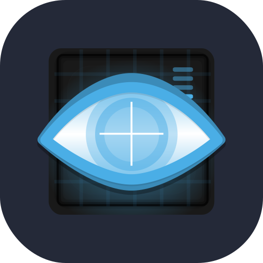
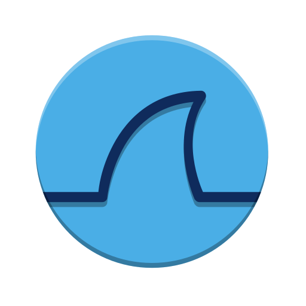
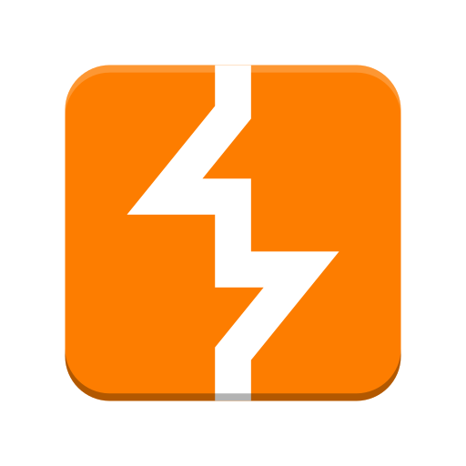
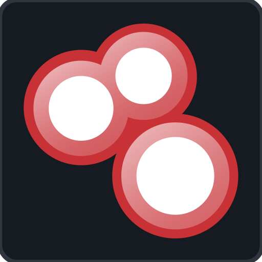
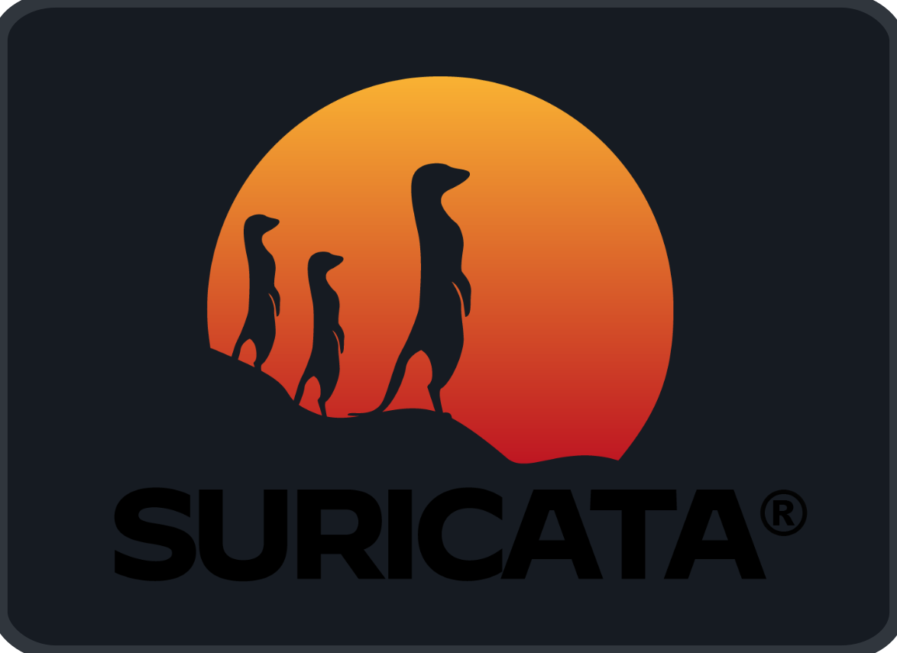
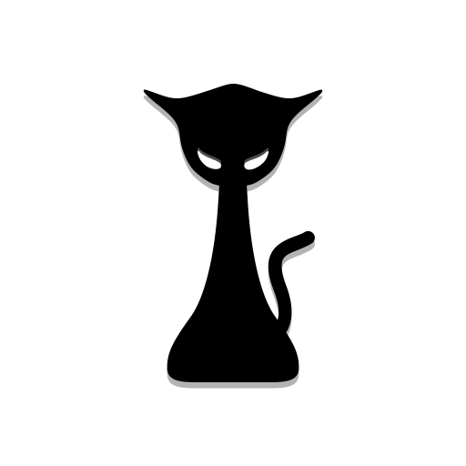
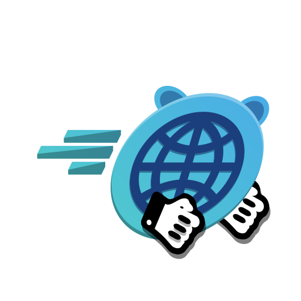
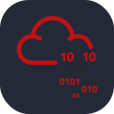

<!--
  ╔══════════════════════════════════════════════════════════════╗
  ║         ullas23 | GitHub Profile README                     ║
  ║         Purple Team · SOC · AI-Powered Security             ║
  ╚══════════════════════════════════════════════════════════════╝
-->

<b>Cybersecurity • AI • Network Defense • Purple Team</b>

## Capabilities

### Operating Systems
<table>
  <tr align="center">
    <td></td>
    <td></td>
    <td></td>
  </tr>
  <tr align="center">
    <td>Ubuntu</td>
    <td>Kali Linux</td>
    <td>Windows</td>
  </tr>
</table>

### Languages and Tools
<table>
  <tr align="center">
    <td></td>
    <td></td>
    <td></td>
    <td></td>
    <td></td>
    <td></td>
    <td></td>
    <td></td>
    <td></td>
  </tr>
  <tr align="center">
    <td>Python</td>
    <td>C</td>
    <td>SQLite</td>
    <td>React</td>
    <td>FastAPI</td>
    <td>Git</td>
    <td>GitHub</td>
    <td>VS Code</td>
    <td>Bash</td>
  </tr>
</table>

### Security Arsenal
<table>
  <tr align="center">
    <td></td>
    <td></td>
    <td></td>
    <td></td>
    <td></td>
    <td></td>
    <td></td>
    <td></td>
    <td></td>
  </tr>
  <tr align="center">
    <td>Nmap</td>
    <td>Wireshark</td>
    <td>Burp Suite</td>
    <td>Metasploit</td>
    <td>Shodan</td>
    <td>Zeek</td>
    <td>Suricata</td>
    <td>Hashcat</td>
    <td>Gobuster</td>
  </tr>
</table>

 

<h2>Find me on</h2>

&nbsp;&nbsp;

&nbsp;&nbsp;

&nbsp;&nbsp;

&nbsp;&nbsp;

&nbsp;&nbsp;

&nbsp;&nbsp;

&nbsp;&nbsp;

  

These are my latest projects pinned below!

