<!--
  ╔══════════════════════════════════════════════════════════════╗
  ║         ullas23 | GitHub Profile README                     ║
  ║         Purple Team · SOC · AI-Powered Security             ║
  ╚══════════════════════════════════════════════════════════════╝
-->
<div align="center">

</div>


## `ullas23@github:~$ neofetch`

<div align="left">

**Languages**


<br/>

**Frameworks & Tools**


<br/>

**Platforms**


<br/>

</div>

```bash
   Security Toolkit
   Nmap · Wireshark · Burp Suite · Metasploit · Shodan

   Focus
   SOC · Network Security · Incident Response
```


## `ullas23@github:~$ ls projects/`
<div align="center">
<!--  GuardLink  -->
<table>
<tr>
<td valign="top" width="50%">

**🛡️ GuardLink**

AI-powered SIEM platform for real-time log analysis, anomaly detection, threat intelligence correlation, and incident monitoring.

`Python` &nbsp; `FastAPI` &nbsp; `Gemini API` &nbsp; `SIEM` &nbsp; `ML`

<br/>

**[→ View Repository](https://github.com/ullas23/GuardLink)**

</td>

<!--  SEPMS  -->
<td valign="top" width="50%">

**🔐 SEPMS**

Award-winning Secure Examination Paper Management System implementing Defense-in-Depth: MFA, RBAC, AES-256, RSA-2048 digital signatures & AI-assisted generation.

`Python` &nbsp; `SQLite` &nbsp; `AES-256` &nbsp; `RSA-2048` &nbsp; `SHA-256`

**[→ View Repository](https://github.com/ullas23/SEPMS)**

</td>
</tr>
<tr>
<td valign="top" width="50%">

**⚡ Samarthya 2026**

Secure Norse mythology-themed event registration platform for IEEE Samarthya 2026. Automated registration workflows and cloud deployment.

`React` &nbsp; `TypeScript` &nbsp; `Vercel` &nbsp; `Google Apps Script`

**[→ View Repository](https://github.com/ullas23/Samarthya2026ieeessitsb)**

</td>
<td valign="top" width="50%">

**🔭 More Coming...**

Active work in progress. Building security tooling and research projects continuously.

`Stay Tuned`

</td>
</tr>
</table>

</div>


## `ullas23@github:~$ cat philosophy.txt`

```bash
┌─────────────────────────────────────────────────────────────┐
│   Think like an attacker.                                   │
│                                                             │
│   Build like a defender.                                    │
│                                                             │
│   Automate where possible.                                  │
│                                                             │
│   Never stop learning.                                      │
└─────────────────────────────────────────────────────────────┘
```


## `ullas23@github:~$ ./connect`

<div align="center">
<a href="https://www.linkedin.com/in/ullasts">
  
</a>
&nbsp;&nbsp;&nbsp;&nbsp;
<a href="mailto:ullasts.2312@gmail.com">
  
</a>
<br/><br/>
*Open to security roles, collaborations, and CTF teams.*
</div>


<div align="center">

</div>

<!--
  Profile views counter (optional — enable after publishing)
  
-->
